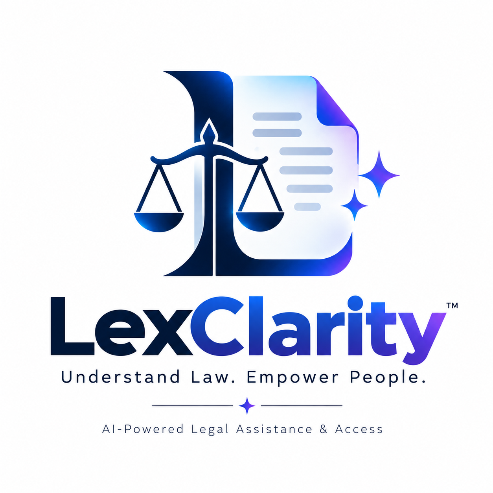

<div align="center">
  
  <br/>
  <p><strong>Democratizing Access to Legal Understanding through Generative AI</strong></p>
  <p><i>Built for the AI for Legal Assistance & Access Hackathon</i></p>
  <br/>
  <p>
    👨‍💻 <strong>Developed by K. Bharath Nayak</strong><br/>
    📧 <a href="mailto:kethavathbharathn@gmail.com">kethavathbharathn@gmail.com</a> &nbsp;|&nbsp;
    🔗 <a href="https://www.linkedin.com/in/kethavath-bharath-b70a333a7">LinkedIn</a>
  </p>
</div>

---

## 🛑 The Problem Statement
Legal information is complex, heavily jargonized, and exceptionally difficult for the average person to navigate without expensive professional assistance. This severely limits **access to justice** and leaves marginalized communities vulnerable to predatory agreements and hidden legal risks.

## 💡 Our Solution (Aligning with AI for Legal Assistance & Access)
**LexClarity** is a GenAI-powered legal tech platform directly addressing the **AI for Legal Assistance & Access** mandate. By making contracts, agreements, and policies instantly understandable, we are democratizing access to basic legal intuition. Rather than replacing a lawyer, LexClarity acts as a "Legal Co-Pilot," empowering users to understand what they are signing, identify risks, and prepare highly targeted questions for professional legal aid in a cost-effective manner.

---

## ✨ Key Features (Matching the Hackathon Rubric)

- **📄 Side-by-Side Simplification:** Upload dense legal texts and instantly view a side-by-side translation into plain English. 
- **⚖️ Smart Contract Comparison:** Upload an original and a redlined contract. The AI generates a semantic diff, instantly surfacing moved clauses, hidden risks, and summarizing exactly *why* a change matters.
- **🚨 Risk & Obligation Highlighting:** Every clause is assigned a risk score (High/Medium/Low) based on industry standards (e.g., unlimited liability, aggressive late fees).
- **🙋 "Ask a Lawyer" Generation:** We ensure users are prepared to talk to professionals. Every clause automatically generates targeted questions to ask a lawyer during a formal review.
- **💬 Context-Aware AI Assistant:** Ask questions about your uploaded document. The AI dynamically searches the specific clauses to formulate its responses, heavily reducing hallucination via contextual chunking.

---

## 🚀 Innovation First: Out-of-the-Box Thinking
While standard LLMs can summarize text, LexClarity introduces **Semantic Chunking**. Instead of feeding a massive document entirely into a prompt, our architecture simulates breaking the document down specifically by *clauses*. 
1. This ensures the AI doesn't forget details hidden in the middle of long contracts.
2. It allows us to explicitly cite the exact clause when the AI answers a question.
3. It guarantees **Zero-Retention** privacy—a critical innovation for handling highly sensitive legal data securely in modern architectures. 

---

## 🛠 Technology Stack
- **Frontend Framework:** Next.js 16 (App Router)
- **Styling:** Tailwind CSS + Framer Motion (for fluid micro-interactions)
- **UI Architecture:** Custom Glassmorphism System built on `lucide-react`
- **Simulation Layer:** Emulated Semantic RAG (Retrieval-Augmented Generation)

---

## ⚠️ Important Legal Boundary
Included structurally in the application is a persistent, non-dismissible warning: 
> *"⚖️ This tool provides general information, not legal advice. Consult a qualified attorney for specific situations."*

LexClarity is designed to **inform and prepare** users, drastically reducing the billable hours required for a lawyer to explain the basics, while safely handing off the user for strict legal judgment.

---

## 💻 Running the Project Locally

```bash
# 1. Clone or download the repository
# 2. Navigate to the project folder
cd lexclarity

# 3. Install dependencies
npm install

# 4. Start the development server
npm run dev
```

Visit `http://localhost:3000` to view the application.
